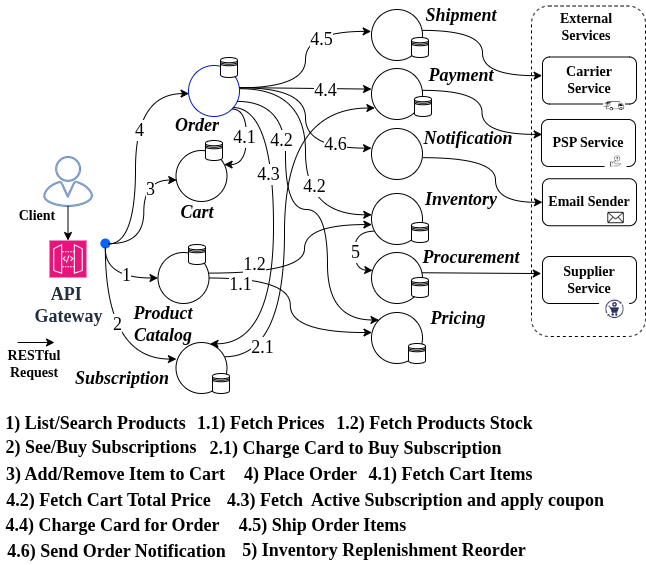
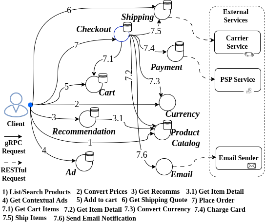
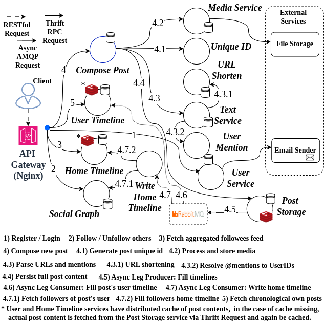

# Stabilizing Agentification (Architecture Refactoring) of Microservice Systems To LLM-Based Agentic-AI Systems

## Microservice System Benchmarks:

- **RetailBen** (ms_baseline/retailben) (Own Designed)
  
  

-------------------

- **[*Google Online Boutique Microservices](https://github.com/GoogleCloudPlatform/microservices-demo)** (ms_baseline/google_ms)
  
   

------------------

- **[DeathStarBench Social Network](https://github.com/delimitrou/DeathStarBench/tree/master/socialNetwork)** (ms_baseline/dsb_social)
  
   
   

----------------------------


## AI Agents Implementation:

All AI agents are implemented using Python, Langgraph framework, and communicating via Ollama server via API (local in our setup but can modified to a remote server) to use open sources LLMs, while can also use major AI vendors by API key (e.g., gemini, claude, openAI).

For each microservice in each benchmark, an equivalent AI agent is implemented with the same database technology, DDD entities, communication interface (e.g., RESTful APIs, gRPC or thrift) are used for agents, and only the static functionality and logic of services converted as dynamic reasoning. Hence, the AI agents are pluggable in the system, so each component in the benchmarks can deployed either as service or AI agent.

- **RetailBen** (refactored_architecture/retailben)
- **Google Online Boutique Microservices** (refactored_architecture/google_ms)
- **DeathStarBench Social Network** (**still working, not ready yet!**) 

----------------------------

# Prerequisite

## Run Ollama server (locally / remote server) 
### (Needs a GPU node with at least 48GB of memory)

The ollama server should be installed first, then ready to be started (with inference optimization) and pull open sourced models:

```bash
    # configuration for inference optimization (required for maximum throughput and memory usage efficiency)
    setenv OLLAMA_FLASH_ATTENTION 1 # Enables Flash Attention on modern GPUs
    setenv OLLAMA_KV_CACHE_TYPE q4_0 # Compresses the KV cache with lower quantization
    setenv OLLAMA_KEEP_ALIVE 2h # keeps the model for 2h, eliminating "cold start" for subsequent requests.
    setenv OLLAMA_NUM_PARALLEL 100 # Defines how many simultaneous requests a single model will process.

    # start server
    systemctl start ollama
    ollama pull llama3.2:3b
    ollama pull qwen3:14b

    # warm up (load the model in memory)
    ollama run llama3.2:3b "Explain CAP theorem in 3 sentences."
    ollama run qwen3:14b "Explain CAP theorem in 3 sentences."
```

## Run local dockerized database and message broker

- MongoDB: 
    ```
    docker compose up -d mongodb
    ```

- Redis: 
    ```
    docker compose up -d redis
    ```

- RabbitMQ: 
    ```
    docker compose up -d rabbitmq
    ```

**Check default user/password/db_name that set here in codes respectively, thereafter.**

----------------------------


# Deploy architectures (Microservice or Hybrid with agents) and Run Experiments

There is a **deploy-local.sh** script in the deploy_orchestration folder for each benchmark, which receives the list of service (with ports) and agents to deploy each component as service or AI agent.  

## Deployment of microservice baseline and gather metrics

1-  **Google Online Boutique Microservices**

    
    # 1. Deploy locally

```bash
    cd deploy_orchestration/google_ms
    
    ./deploy-local.sh services=ad_service:5057,cart_service:5054,checkout_service:5050,currency_service:5053,email_service:5056,payment_service:5052,product_catalog_service:5055,recommendation_service:5058,shipping_service:5051 agents=

    # 2. Evaluate with workload and gather metrics
    python3 -m ms_baseline.google_ms.exp_runner
    
    # the full evaluation results will be gathered in ms_baseline/google_ms/results folder.
```

2-  **RetailBen**

```bash
    # 1. Deploy locally

    cd deploy_orchestration/retailben
    
    ./deploy-local.sh services=payment_service:8007,inventory_service:8001,shipment_service:8006,shopping_cart_service:8003,pricing_service:8002,product_search_service:8008,procurement_service:8009,order_service:8000,subscription_service:8010,notification_service:8011 agents=

    # 2. Evaluate with workload and gather metrics
    cd ms_baseline/retailben
    python3 exp_runner.py

    # the full evaluation results will be gathered in ms_baseline/retailben/results folder.
```

-----------------------------


## Running migration loops for all baselines, by deployment of hybrid architectures (at each migration step) and gather step-wise and complete metrics 

For each baseline migration cycle based on a ranking strategy, acceptability predicate mode, and governance mechanism, the outcome metrics should be gathered, and then be aggregated.


### Run baselines migration loops

**Run full migration cycle for each baseline, by looping over model size (x2), temperature (x2), concurrency levels (x2), ranking strategy (x6) (here with equal weights of risk metrics), predicate mode (x4) and governance mode (x3)**

Hence there are total 576 full migration cycle experiments for each benchmark.

For each migration step for each of baselines, the target hybrid architecture is deployed locally (internally using **deploy-local.sh** script explained before), the full multi-trial evaluation is performed and all outcome metrics are gathered), and then the architecture is shutdown (internally using shutdown-local.sh script besides deploy-local.sh) to be ready for next step. The full procedure is automated by these DevOps based scripts and be run for all migration cycles for each baseline, in each benchmark, by only running the **baseline_ablation_progressive_refactor_orchestrator.py** python script as below:


1-  **Google Online Boutique Microservices**

 ```bash   
    cd deploy_orchestration/google_ms
    
    python3 baseline_ablation_progressive_refactor_orchestrator.py

    
    # the full evaluation results will be gathered in refactored_architecture/google_ms/results folder, separately under subfolder named with each ranking strategy.
```

2-  **RetailBen**

 ```bash   
    cd deploy_orchestration/retailben
    
    python3 baseline_ablation_progressive_refactor_orchestrator.py

    
    # the full evaluation results will be gathered in refactored_architecture/google_ms/results folder, separately under subfolder named with each ranking strategy.
```

### Aggregate and analyze baseline results

1-  **Google Online Boutique Microservices**

```bash
    cd refactored_architecture/google_ms

    # aggregate all individual results for each ranking strategy
    python3 aggregate_results.py

    # analyze all aggregated results, to find the best, worst, selective strategy
    python3 analyze_results.py
```


2-  **RetailBen**

```bash
    cd refactored_architecture/retailben

    # aggregate all individual results for each ranking strategy
    python3 aggregate_results.py

    # analyze all aggregated results, to find the best, worst, selective strategy
    python3 analyze_results.py
```

--------------------------


### Run Explainability (weights ablation (x7) + Shapley-based analysis (x32) to find contribution), Robustness (by Monte Carlo simulation with weights sampling from Dirichlet simplex distribution (x100)) and Tuning experiments (by grid search of weights to minimize total disturbances)


1-  **Google Online Boutique Microservices**

```bash
    cd deploy_orchestration/google_ms
    
    python3 weight_study_progressive_refactor_orchestrator.py

    
    # the full evaluation results will be gathered in refactored_architecture/google_ms/results folder, separately under subfolder named with each ranking strategy, then analyzed manually.
```

2-  **RetailBen**

```bash
    cd deploy_orchestration/retailben
    
    python3 weight_study_progressive_refactor_orchestrator.py

    
    # the full evaluation results will be gathered in refactored_architecture/retailben/results folder, separately under subfolder named with each ranking strategy, then analyzed manually
```


